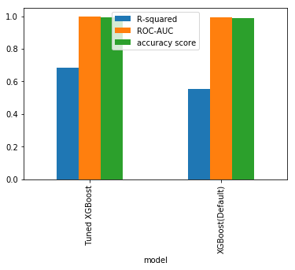

# Machine Learning Engineer Nanodegree
## Capstone
## Project: Air pressure system failures in Scania trucks

Hajime Kawata  
February 26st, 2019

## I. Definition

In this project, we classify sensor data related to faulure in air pressure system or not.

### Domain Background

Reducing the failure rate of trucks is critical in logictics business.
That directly impacts profitability and customer satisfaction.
Until now, logistics companies rely on regular maintenance to prevent the occurrence of failures.
However, since the utilization rate of trucks exceeds the days what has been assumed to be covered by periodic maintenance, the percentage of post-maintenance caused by failures increasing, which has been a problem for some time.

For this reason, it is strongly required to detect potential failures in time before the actual failures.
In order to properly capture signs of failure, it has been considered to use data collected from sensors installed in trucks, bu sensor data is gathered in the order of milliseconds, and collection targets are also diverse.
As a result, several hundred megabytes of data may be generated from one track in a day.
A large data cost has been anticipated.

In this project in order to quickly and flexibly arrange trucks based on failure prediction.
- Find sensors to detect failures.
- Perform a failure prediction based on the logic derived from the sensor data

This would make it possible to alerts before the actual failure occurrence.
As a result control centor of the fleet management system of logistics company can properly improve trucks utilization.

### Problem Statement

In this project we take the sensor data from the track Air Pressure System, which is provided to Kaggle[1] as an example.
We are going to build a classification model that appropriately classifies whether the data acquired from the sensor is a sensor data combination that leads to an Air Pressure System error.
Based on this classification, failure occurrence is predicted.
In general, when monitoring the operation status of assets using sensors, in most cases, it is necessary to acquire data of a time period during which no problem occurs while in a normal operation.
Therefore, when constructing a model that detects an abnormal condition, it is necessary to confirm that the error state is appropriately included in the target data set.

In model construction, in order to improve classification accuracy, it is common to consider pre-processing of data according to the characteristics of the data set.
In this project, we first analyze the characteristics of the data set of the target model.
In addition, we will consider, implement and evaluate the application of the optimal model.
In constructing the classification model, we adopt XGBoost and tackle the problem with the following approaches.

1. Load data to obtain training data set and test data set.
2. Analyze data to understanda dataset and design necessary preprocessing of data for model construction.
3. Apply some predicting model classifiers to benchmark the good classifiers in this use case.
4. Tune the XGBoost predicting model classifiers predictor to improve the classification capability of the model.
5. Evaluate with the model with given test set, with confusion matrix, and accuracy, precision, and f1 scores.
6. Evaluate the contribution of feature, to discuss the possibility of reducing the sensors to predict failures.

### XGBoost

In this project, to detect the target Air pressure system with high accuracy,
we apply a machine learning method known as XGBoost [2].
XGBoost is one of machine learning ensemble methods known to give good results to various problems.
XGBoost has a mechanism to accelerate learning called Gradient Boost,
It is a method combining a mechanism that selects the best model called Randome Forest from multiple candidates.
A mechanism is incorporated to prevent problems such as excessive learning occurring in Randoem Forest, which is too compatible with the data at the time of construction of the model, resulting in inappropriate classification of new data.

The prediction accuracy of XGBoost improves more than Random Forests,
On the other hand, there are multiple parameters that need tuning.
In this project, a method called Grid Search is used for parameter adjustment.

## II. Analysis

## Data Exploration

### Provided Data

In this project, *the dataset consists of data collected from heavy Scania trucks in everyday usage. The system in focus is the Air Pressure system (APS) which generates pressurized air that is utilized in various functions in a truck, such as braking and gear changes.*[1]

The Air Pressure System is used to reduce load shocks and is an important system in logistics trucks.
Training data for model construction and test data for verification are given in advance in the Kaggle dataset.
Using the training data, we derive the prediction model of the occurrence of the failure (label) from the sensor data (features).
This prediction logic is applied to the test data and the ability of the prediction logic is evaluated.
The sensor data is anonymized for confidentiality reasons, and so we have to make the prediction model purely on mathematical and statistical approach.

Below, combinations of data sets and files given as training data and test data are shown.

| dataset| file |
|-|-|
| Training Data to build a model | data/aps_failure_training_set_processed_8bit.csv |
| Test Data to evaluate the build model | data/aps_failure_test_set_processed_8bit.csv |

### Datasets and Inputs

In this data set, in order to discriminate whether it is failure data of Air Pressure System or other data,
data is classified into the following two classes.

| Category | Description |
|----------|-------------|
| positive class | *consists of component failures for a specific component of the APS system.* |
| negative class | *consists of trucks with failures for components not related to the APS.*  | 

Following is the data volume information for each classes.

| _ | Total | Positive | Negative | features |
|-|-|-|-|-|
| Train | 60000 | 1000 | 59000 | 171 |
| Test  | 16000 |  -    | -     | 171 |

In the classifier introduced in this project, it is required to appropriately classify the data set that becomes a positive class.
In the following, in order to make it easy to identify the two target classes by the machine learning model,
0.992188 for positive class and -0.992188 for negative class,
We re-labeled positive class as 1 and negative class as 0 with integer values.

Thus, in the following, we build a classification model that properly classifies the data set whose class is 1.
In the classifier introduced in this project, it is required to appropriately classify the data set that are classified to the positive class.
In the following, in order to make it easy to identify the two target classes by the machine learning model,
0.992188 for positive class and -0.992188 for negative class, we re-labeled positive class as 1 and negative class as 0 with integer values.

Thus, in the following, we build a classification model that properly classifies the data set whose class is 1.

Following is the example data from the dataset.

<table border="1" class="dataframe">
  <thead>
    <tr style="text-align: right;">
      <th></th>
      <th>class</th>
      <th>aa_000</th>
      <th>ab_000</th>
      <th>ac_000</th>
      <th>ad_000</th>
      <th>ae_000</th>
      <th>af_000</th>
      <th>ag_000</th>
      <th>ag_001</th>
      <th>ag_002</th>
      <th>...</th>
      <th>ee_002</th>
      <th>ee_003</th>
      <th>ee_004</th>
      <th>ee_005</th>
      <th>ee_006</th>
      <th>ee_007</th>
      <th>ee_008</th>
      <th>ee_009</th>
      <th>ef_000</th>
      <th>eg_000</th>
    </tr>
  </thead>
  <tbody>
    <tr>
      <th>0</th>
      <td>-0.992188</td>
      <td>0.117188</td>
      <td>-0.289062</td>
      <td>0.992188</td>
      <td>-0.007812</td>
      <td>-0.046875</td>
      <td>-0.054688</td>
      <td>-0.007812</td>
      <td>-0.03125</td>
      <td>-0.054688</td>
      <td>...</td>
      <td>0.687500</td>
      <td>0.515625</td>
      <td>0.234375</td>
      <td>0.070312</td>
      <td>0.007812</td>
      <td>-0.109375</td>
      <td>-0.140625</td>
      <td>-0.171875</td>
      <td>-0.023438</td>
      <td>-0.023438</td>
    </tr>
    <tr>
      <th>1</th>
      <td>-0.992188</td>
      <td>-0.179688</td>
      <td>-0.289062</td>
      <td>-0.468750</td>
      <td>-0.007812</td>
      <td>-0.046875</td>
      <td>-0.054688</td>
      <td>-0.007812</td>
      <td>-0.03125</td>
      <td>-0.054688</td>
      <td>...</td>
      <td>-0.023438</td>
      <td>-0.062500</td>
      <td>-0.132812</td>
      <td>-0.132812</td>
      <td>-0.187500</td>
      <td>-0.148438</td>
      <td>-0.085938</td>
      <td>-0.140625</td>
      <td>-0.023438</td>
      <td>-0.023438</td>
    </tr>
    <tr>
      <th>2</th>
      <td>-0.992188</td>
      <td>-0.125000</td>
      <td>-0.289062</td>
      <td>-0.468750</td>
      <td>-0.007812</td>
      <td>-0.046875</td>
      <td>-0.054688</td>
      <td>-0.007812</td>
      <td>-0.03125</td>
      <td>-0.054688</td>
      <td>...</td>
      <td>-0.140625</td>
      <td>-0.093750</td>
      <td>-0.015625</td>
      <td>0.015625</td>
      <td>-0.007812</td>
      <td>-0.109375</td>
      <td>-0.093750</td>
      <td>-0.164062</td>
      <td>-0.023438</td>
      <td>-0.023438</td>
    </tr>
    <tr>
      <th>3</th>
      <td>-0.992188</td>
      <td>-0.406250</td>
      <td>-0.289062</td>
      <td>-0.468750</td>
      <td>-0.007812</td>
      <td>-0.046875</td>
      <td>-0.007812</td>
      <td>-0.007812</td>
      <td>-0.03125</td>
      <td>-0.054688</td>
      <td>...</td>
      <td>-0.382812</td>
      <td>-0.382812</td>
      <td>-0.375000</td>
      <td>-0.351562</td>
      <td>-0.312500</td>
      <td>-0.195312</td>
      <td>-0.304688</td>
      <td>-0.171875</td>
      <td>0.890625</td>
      <td>0.992188</td>
    </tr>
    <tr>
      <th>4</th>
      <td>-0.992188</td>
      <td>0.007812</td>
      <td>-0.289062</td>
      <td>-0.468750</td>
      <td>-0.007812</td>
      <td>-0.046875</td>
      <td>-0.054688</td>
      <td>-0.007812</td>
      <td>-0.03125</td>
      <td>-0.054688</td>
      <td>...</td>
      <td>0.156250</td>
      <td>0.031250</td>
      <td>-0.031250</td>
      <td>-0.039062</td>
      <td>-0.046875</td>
      <td>-0.015625</td>
      <td>0.656250</td>
      <td>-0.148438</td>
      <td>-0.023438</td>
      <td>-0.023438</td>
    </tr>
  </tbody>
</table>

We will consider the necessary preprocessing of the featues values from sensors below.
If the scales of the values for each feature are different, for example, the calculation error by the computer may affect the prediction preciseness and accuracy. Also, if there is extreme bias of the values, it may affect prediction accuracy.
In constructing the prediction model, it is customary to grasp the characteristics of a given training data, perform necessary pretreatment, and eliminate these influences as much as possible.

### Necessity discussion on data scaling

First of all, in seeing the bias of data, 171 feature quantities were plotted in the box diagram.
All data are within the range of -1 to 1.
For the 75th percentile, its width varies for each feature.
Although the overall data has been preconditioned to fit within the range of -1 to 1, the data of the 75 th percentile is within the order of 0.01.
Also, it can be seen that data that does not fit in the 75th percentile (black point in the figure) called Outlier has spread in each feature amount.

In the following, we analyze the above-mentioned bias of distribution and features on Outlier and verify whether or not to process, and what kind of processing should be done if it should be processed.

Specifically, when looking at the percentile value of some data, it can be seen that there are more sensor data values with the same value at each of the 25th, 50th and 75th percentiles.
It is understood that the concentration is concentrated to some values extremely.

This is a situation that is sufficient if it is assumed that the target is a sensor, and most of them measure steady state other than the failure state.
When performing machine abnormality diagnosis, it is thought that it is necessary to construct a model that derives less abnormal data from overwhelming majority of normal data.

A part of each statistical data of the feature quantity in the training data set is displayed.

<table border="1" class="dataframe">
  <thead>
    <tr style="text-align: right;">
      <th></th>
      <th>class</th>
      <th>aa_000</th>
      <th>ab_000</th>
      <th>ac_000</th>
      <th>ad_000</th>
      <th>ae_000</th>
      <th>af_000</th>
      <th>ag_000</th>
      <th>ag_001</th>
      <th>ag_002</th>
      <th>...</th>
      <th>ee_002</th>
      <th>ee_003</th>
      <th>ee_004</th>
      <th>ee_005</th>
      <th>ee_006</th>
      <th>ee_007</th>
      <th>ee_008</th>
      <th>ee_009</th>
      <th>ef_000</th>
      <th>eg_000</th>
    </tr>
  </thead>
  <tbody>
    <tr>
      <th>count</th>
      <td>60000.000000</td>
      <td>60000.000000</td>
      <td>60000.000000</td>
      <td>60000.000000</td>
      <td>60000.000000</td>
      <td>60000.000000</td>
      <td>60000.000000</td>
      <td>60000.000000</td>
      <td>60000.000000</td>
      <td>60000.000000</td>
      <td>...</td>
      <td>60000.000000</td>
      <td>60000.000000</td>
      <td>60000.000000</td>
      <td>60000.000000</td>
      <td>60000.000000</td>
      <td>60000.000000</td>
      <td>60000.000000</td>
      <td>60000.000000</td>
      <td>60000.000000</td>
      <td>60000.000000</td>
    </tr>
    <tr>
      <th>mean</th>
      <td>0.016667</td>
      <td>-0.124611</td>
      <td>-0.071121</td>
      <td>-0.198529</td>
      <td>-0.007737</td>
      <td>-0.033483</td>
      <td>-0.040633</td>
      <td>-0.006584</td>
      <td>-0.026241</td>
      <td>-0.040699</td>
      <td>...</td>
      <td>-0.104808</td>
      <td>-0.098734</td>
      <td>-0.094976</td>
      <td>-0.089227</td>
      <td>-0.103374</td>
      <td>-0.088961</td>
      <td>-0.084540</td>
      <td>-0.067471</td>
      <td>-0.020035</td>
      <td>-0.018417</td>
    </tr>
    <tr>
      <th>std</th>
      <td>0.128020</td>
      <td>0.367680</td>
      <td>0.356812</td>
      <td>0.564872</td>
      <td>0.004138</td>
      <td>0.107086</td>
      <td>0.111752</td>
      <td>0.032016</td>
      <td>0.065200</td>
      <td>0.105864</td>
      <td>...</td>
      <td>0.356547</td>
      <td>0.362066</td>
      <td>0.363148</td>
      <td>0.336121</td>
      <td>0.320314</td>
      <td>0.237613</td>
      <td>0.363893</td>
      <td>0.261009</td>
      <td>0.051907</td>
      <td>0.061751</td>
    </tr>
    <tr>
      <th>min</th>
      <td>0.000000</td>
      <td>-0.406250</td>
      <td>-0.289062</td>
      <td>-0.468750</td>
      <td>-0.007812</td>
      <td>-0.046875</td>
      <td>-0.054688</td>
      <td>-0.007812</td>
      <td>-0.031250</td>
      <td>-0.054688</td>
      <td>...</td>
      <td>-0.382812</td>
      <td>-0.382812</td>
      <td>-0.382812</td>
      <td>-0.351562</td>
      <td>-0.312500</td>
      <td>-0.195312</td>
      <td>-0.304688</td>
      <td>-0.171875</td>
      <td>-0.023438</td>
      <td>-0.023438</td>
    </tr>
    <tr>
      <th>25%</th>
      <td>0.000000</td>
      <td>-0.398438</td>
      <td>-0.289062</td>
      <td>-0.468750</td>
      <td>-0.007812</td>
      <td>-0.046875</td>
      <td>-0.054688</td>
      <td>-0.007812</td>
      <td>-0.031250</td>
      <td>-0.054688</td>
      <td>...</td>
      <td>-0.382812</td>
      <td>-0.382812</td>
      <td>-0.375000</td>
      <td>-0.343750</td>
      <td>-0.312500</td>
      <td>-0.195312</td>
      <td>-0.304688</td>
      <td>-0.171875</td>
      <td>-0.023438</td>
      <td>-0.023438</td>
    </tr>
    <tr>
      <th>50%</th>
      <td>0.000000</td>
      <td>-0.195312</td>
      <td>-0.289062</td>
      <td>-0.468750</td>
      <td>-0.007812</td>
      <td>-0.046875</td>
      <td>-0.054688</td>
      <td>-0.007812</td>
      <td>-0.031250</td>
      <td>-0.054688</td>
      <td>...</td>
      <td>-0.179688</td>
      <td>-0.179688</td>
      <td>-0.195312</td>
      <td>-0.179688</td>
      <td>-0.226562</td>
      <td>-0.171875</td>
      <td>-0.296875</td>
      <td>-0.171875</td>
      <td>-0.023438</td>
      <td>-0.023438</td>
    </tr>
    <tr>
      <th>75%</th>
      <td>0.000000</td>
      <td>-0.070312</td>
      <td>-0.000000</td>
      <td>-0.468750</td>
      <td>-0.007812</td>
      <td>-0.046875</td>
      <td>-0.054688</td>
      <td>-0.007812</td>
      <td>-0.031250</td>
      <td>-0.054688</td>
      <td>...</td>
      <td>-0.007812</td>
      <td>0.015625</td>
      <td>0.015625</td>
      <td>0.007812</td>
      <td>-0.054688</td>
      <td>-0.101562</td>
      <td>-0.000000</td>
      <td>-0.132812</td>
      <td>-0.023438</td>
      <td>-0.023438</td>
    </tr>
    <tr>
      <th>max</th>
      <td>1.000000</td>
      <td>0.992188</td>
      <td>0.992188</td>
      <td>0.992188</td>
      <td>0.992188</td>
      <td>0.992188</td>
      <td>0.992188</td>
      <td>0.992188</td>
      <td>0.992188</td>
      <td>0.992188</td>
      <td>...</td>
      <td>0.992188</td>
      <td>0.992188</td>
      <td>0.992188</td>
      <td>0.992188</td>
      <td>0.992188</td>
      <td>0.992188</td>
      <td>0.992188</td>
      <td>0.992188</td>
      <td>0.992188</td>
      <td>0.992188</td>
    </tr>
  </tbody>
</table>

Looking at the actual proportion of class 1 showing abnormality of Air Pressure System, there are 60,000 training data in total, 1,000 of which are target positive class (17%).
This suggests that majority of the 171 sensors may indicate the same value as the steady state even in abnormal cases even when APS abnormality occurs.
It is unrealistic to perform a combination for discriminating abnormal conditions from among human's characteristics, and it is necessary to propose a method to automatically perform through a scientific approach.

| Class | Training Dataset | Test Dataset |
|-|-|-|
|Negative Class | 59,000 | 15,625 |
|Positive Class | 1,000 | 375 |
|Percentage of Positive Class | 1.7% | 2.3% |

In considering the preprocessing, next, we investigate the correlation between the feature quantities of the data adopted this time.

The correlation coefficient between sensor data is shown as a heat map.
This heat map is displayed with red closer to white as the positive correlation is stronger, and blue closer to white as negatively strong.
Regarding the relationship between the strength of the correlation and the color of the heat map, the scale on the right bar of the figure is shown.
Combinations of feature quantities which are close to white in the heat map are totally seen.
From this, it can be seen that there are many combinations of feature quantities with strong positive correlation.

As for the target data, since the name of the feature quantity is anonymized, it is unknown what the measurement object and method of the specific sensor are.
Therefore, the measurement target between sensors is unknown here.
In general, there are cases where a plurality of sensors are installed for the same device to verify the difference in sensor information depending on the mounting position and the like.
Inferring from such a fact, it is conceivable that data of events occurring in the same equipment will be acquired and strong correlation will be seen.

By integrating feature values ​​with strong correlation and newly setting features with high independence, we will reduce the calculation cost when building the model and improve the prediction accuracy.

When the distribution of values is extremely different between feature quantities, accuracy may be affected by influence of computer rounding.
Therefore, due to scale conversion, the influence due to the width of distribution may be avoided.
The target data of this report was originally scaled in the range of -1 to 1 as shown in the box diagram above.
Therefore, as you can see in the box diagram below after the scale return, the state of the distribution did not change, and it was judged that the effect of scale conversion on this data is small.
Scale conversion is not applied when building this model.

dThe 75th percentile data is concentrated in the center.
On the other hand, it can be seen that the remaining data spread widely.
Consider excluding data far from the center of the cluster as Outlier under the assumption that it is data after PCA application and is clustered
In this case, Outlier was judged by One Class SVM [3].

In converting to PCA, the feature amount was chosen with a contribution ratio of 98%. As a result, the feature quantity of 171 is reduced to 67. It can be seen that the feature quantities after reduction are uncorrelated and the cross correlation coefficient is almost 0.

For the feature amount after PCA conversion, drawing a box diagram shows that many data are aggregated around 0 and that the skirt of data not included in the 75 th percentile is long.
For a given training data, there are many uniform data, and it can be seen that the data deviating therefrom has diversity.

By using PCA (Primary Component Classifier) ​​we were able to reduce 171 feature quantities and convert them to 67 feature values ​​with low correlation with each other.
Here, although it can be expected that the calculation cost and accuracy at the time of model construction can be improved, it is verified whether classification is performed properly.
The objective of this project is to increase the accuracy of the model that classifies the positive class (consists of component failures for a specific component of the APS system).
We confirmed how these data are classified after conversion by PCA.

One class SVM determined the percentage of Positive Class and Negative Class separating 50%.
When dividing 60000 data into two, most Positive classes are classified into data classified as Out excluded by One Class SVM.
In classification by One Class SVM, the Positive class to be detected was almost excluded.

|-| Positive | Negative |
|-|-|-|
|Out | 991 | 29009 |
|In | 9 | 2991 |

For sensor data, most of the data is in normal state.
As for the data of this Negative class, it is data which was acquired at the time of abnormality to some kind of in-vehicle component.
In other words, it is data acquired in the situation where the abnormality of the target APS does not occur.
Therefore, from the viewpoint of APS, it is considered that data biased to the normal state is acquired.

So we will not discard the data as outliers, as it includes important data for classification.

### Evaluation Metrics

In evaluating the prediction logic, it is a challenge to extract failure events as much as possible while maintaining the operation rate. For that reason, it is necessary to accurately derive the judgment of correctness. Here, to make the balance of Confusion Matrix, adopt a model with a high result of scoring by ROC-AUC.
We also use accuracy, precision, and recall score for flassifier capability comparison.

### Benchmark Model

As benchmark, adopts 60% correct answer rate.
This is based on a hearing from an interview myself conducted that the failure rate prevented by regular maintenance is about 60% by experience.
It is worth considering the devided model in this project, if failure prediction is more than 60% Accuracy.

However, it is desirable that the accuracy of the model be increased as much as possible.
It is evaluated as data preprocessing to be adopted and benchmark of hyper parameter of XGBoost model compared with Random Forest model.

Random Forest uses a set of decision trees, and each tree represents some decision path to the positive class, from features.
Subset of features are used in each tree.
The features picked up are different amond trees. These features are used in the list of questions as a branch in the tree to reach from the ground to leaves(=income).

Usually, a single tree is not strong enough to be used in practice. To overcome this, Random Forest uses a lot of decision trees which are slightly differentn with each other. When we get a new answer from those trees, we take the majority vote of among the trees to get a final result. Compared to employing a single tree, you can reduce the proportion of incorrect results. By default, a Random Forest will use the sqaure root of the number of features as the maximum features that it will look on any given branch. In our case we have total 171 features, so each decision will be the best of the 5(approximate) randomly selected features available.

It is difficult to measure the quality of a given model without quantifying its performance over training and testing. This is typically done using some type of performance metric, whether it is through calculating some type of error, the goodness of fit, or some other useful measurement. For this project, you will be calculating the coefficient of determination, R2, to quantify your model's performance. The coefficient of determination for a model is a useful statistic in regression analysis, as it often describes how "good" that model is at making predictions.

The values for R2 range from 0 to 1, which captures the percentage of squared correlation between the predicted and actual values of the target variable. A model with an R2 of 0 is no better than a model that always predicts the mean of the target variable, whereas a model with an R2 of 1 perfectly predicts the target variable. Any value between 0 and 1 indicates what percentage of the target variable, using this model, can be explained by the features. A model can be given a negative R2 as well, which indicates that the model is arbitrarily worse than one that always predicts the mean of the target variable.

We apply the R2 score to evaluate the modeling performance based on the equation below.
Tarald O. Kvalseth: "Cautionary Note about R2", The American Statistician Vol. 39, No. 4, Part 1 (Nov., 1985), pp. 279-285

Use R2 score to perform a performance calculation between y_true and y_predict.
* R2 score of 0 means that the dependent variable cannot be predicted from the independent variable.
* R2 score of 1 means the dependent variable can be predicted from the independent variable.
* R2 score between 0 and 1 indicates the extent to which the dependent variable is predictable. An
* R2 score of 0.40 means that 40 percent of the variance in Y is predictable from X.

ROC-AUC and accuracy score are close to 1.0 for any models benchmarked.
But R-squred, coefficient of determination is best 0.552 only for XGBoost.

#### Random Forest Classifier

    Best ROC-AUC: 0.9885
    accuracy score : 0.9858125
    R-squared, coefficient of determination : 0.380
                  precision    recall  f1-score   support
    
               0       0.99      1.00      0.99     15625
               1       0.97      0.41      0.57       375
    
       micro avg       0.99      0.99      0.99     16000
       macro avg       0.98      0.70      0.78     16000
    weighted avg       0.99      0.99      0.98     16000

#### XGBClassifier

    Best ROC-AUC: 0.9944
    accuracy score : 0.98975
    R-squared, coefficient of determination : 0.552
                  precision    recall  f1-score   support
    
               0       0.99      1.00      0.99     15625
               1       0.90      0.63      0.74       375
    
       micro avg       0.99      0.99      0.99     16000
       macro avg       0.95      0.81      0.87     16000
    weighted avg       0.99      0.99      0.99     16000
    
    array([[15600,    25],
           [  139,   236]])

#### XGBoost for reduced features set by PCA transformation

    Best ROC-AUC: 1.0000
    accuracy score : 0.9889375
    R-squared, coefficient of determination : 0.517
                  precision    recall  f1-score   support
    
               0       0.99      1.00      0.99     15625
               1       0.89      0.60      0.72       375
    
       micro avg       0.99      0.99      0.99     16000
       macro avg       0.94      0.80      0.86     16000
    weighted avg       0.99      0.99      0.99     16000

    array([[15598,    27],
           [  150,   225]])

#### XGBoost after PCA and Log Transform

    Best ROC-AUC: 1.0000
    accuracy score : 0.9884375
    R-squared, coefficient of determination : 0.495
                  precision    recall  f1-score   support
    
               0       0.99      1.00      0.99     15625
               1       0.89      0.58      0.70       375
    
       micro avg       0.99      0.99      0.99     16000
       macro avg       0.94      0.79      0.85     16000
    weighted avg       0.99      0.99      0.99     16000

    array([[15598,    27],
           [  158,   217]])

XGBoost improved the predictio model against Random Forest in this case.
But R2 score of 0.40 means that 40 percent of the variance in Y is predictable from X.
Which is lower than the regular maintenance measure.

Although a better result is obtained than RainForest, it can be seen that the R2 score tends to be better without pre-processing the data.
It is also predicted that the R2 score is further improved by adjusting the hyper parameter.
The target data of this time has characteristics on the data distribution that the target class to be detected is included in the minority who deviates from the 75th percentile at the center of the distribution.
It is not perfectly random data but may be in accordance with the probability distribution peculiar to the measurement object.
Therefore, it is inferred that preprocessing of data assuming a normal distribution does not lead to an improvement of the accuracy of the model, rather it is better to positively utilize data of minorities in distribution.

For these reasons, we will adjust the optimal hyperparameter with XGBoost without performing data preprocessing for the initial accuracy of more than 60%.

It is understood that XGBoost which does not perform data preprocessing also shows high performance even if Precision, Recall etc. are seen.

## Seek hyperparameters

With regard to training data and test data, preprocessing is not carried out based on the above, and given data is utilized.
https://xgboost.readthedocs.io/en/latest/python/python_api.html#xgboost.XGBClassifier

In determining the hyperparameter, this project conducted the following search.
We adjusted several parameters beforehand and focused on * max_depth (int) *, * n_estimators (int) * which improved the effect.

| Parameter | Description | Search Rangge |
|-|-|-|
| max_depth (int) | Maximum tree depth for base learners. | [5,6,7] |
| learning_rate (float) | Boosting learning rate (xgb’s “eta”) | 0.1(Fixed) |
| n_estimators (int) | Number of boosted trees to fit.| [300, 500, 700] |
| objective (string or callable) | Specify the learning task and the corresponding learning objective or a custom objective function to be used. | ['binary:logistic'] |
| booster (string) | Specify which booster to use | gbtree |
| gamma (float) | Minimum loss reduction required to make a further partition on a leaf node of the tree. | [0.0] (Fixed) |
|min_child_weight (int) |  Minimum sum of instance weight(hessian) needed in a child. | [1]|
|max_delta_step (int) | Maximum delta step we allow each tree’s weight estimation to be.| [5] |
| subsample (float) | Subsample ratio of the training instance. | [0.5] (Fixed) |
| colsample_bytree (float) | Subsample ratio of columns when constructing each tree. | [0.8] |

    Best ROC-AUC: 1.0000
    accuracy score : 0.99275
    R-squared, coefficient of determination : 0.683
                  precision    recall  f1-score   support
    
               0       0.99      1.00      1.00     15625
               1       0.94      0.74      0.83       375
    
       micro avg       0.99      0.99      0.99     16000
       macro avg       0.97      0.87      0.91     16000
    weighted avg       0.99      0.99      0.99     16000

    array([[15607,    18],
           [   98,   277]])

| Parameter | Description | Search Rangge | Best Parameter|
|-|-|-|-|
| max_depth (int) | Maximum tree depth for base learners. | [5,6,7] | 6 |
| learning_rate (float) | Boosting learning rate (xgb’s “eta”) | 0.1(Fixed) | 0.1|
| n_estimators (int) | Number of boosted trees to fit.| [300, 500, 700] | 500 |
| objective (string or callable) | Specify the learning task and the corresponding learning objective or a custom objective function to be used. | ['binary:logistic'] | 'binary:logistic'|
| booster (string) | Specify which booster to use | gbtree | gbtree |
| gamma (float) | Minimum loss reduction required to make a further partition on a leaf node of the tree. | [0.0] (Fixed) |0.0 |
|min_child_weight (int) |  Minimum sum of instance weight(hessian) needed in a child. | [1]| 1|
|max_delta_step (int) | Maximum delta step we allow each tree’s weight estimation to be.| [5] |5 |
| subsample (float) | Subsample ratio of the training instance. | [0.5] (Fixed) |0.5|
| colsample_bytree (float) | Subsample ratio of columns when constructing each tree. | [0.8] | 0.8|

By seeing the decision tree, we can tell the importance of sensor by traversing the tree nodes from root to leaves.

By adjuesting searching the parameter, we can achieve the model improved classification capability.
Especially improved the recall.

## V. Conclusion

By adopting XGBoost, we could construct a classification prediction model with higher fitness than Random Forest used for benchmark.
By tuning the hyper parameter, it was possible to increase the fitness of the model.

### Reflection

This time, based on the data obtained from sensors around the APS, we created a model that classifies the sensor data to APS failures or others.
As a characteristic of sensor data, the majority of data are obtained while normal.
Also data far from the center of the distribution, in most cases, that could be classified as outliers, also plays an important role in building a classification model.
Although a strong correlation is seen between feature quantities, it is better to utilize the feature data as it is rather than processing such as clustering with PCA or the like, finding the axis representing the feature, and reducing the feature amount I was able to build a model.

This means that if a decision tree that contributes to classification is derived, it is convenient in terms of introducing important feature quantities, that is, sensors, without going through steps such as transformation and inverse transformation of feature amounts required by PCA high.
Trucks and the like are expensive sensors and require much labor, cost and time to install, so this approach utilizing XGBoost is expected to be versatile in the field of failure prediction by onboard sensors .

We adjusted the hyperparameters of XGBoost in this project.
By adjusting, we were able to increase the fitness of the model.
However, we decided not to adjust this parameter over all parameters due to restrictions of computing resources.

### Improvement

There is a possibility that the ratio of the class to be detected was adjusted beforehand in the data set of this time.
In ordinary sensor data, overwhelmingly large amounts of data at normal times are generated.
Therefore, it is considered necessary to verify whether the approach of this time is effective even for data before adjustment, which has less data at abnormal time, in general purpose for practical use.
In addition, XGBoost is a time-consuming approach to adjusting hyperparameters, so it can be expected to improve speed by strengthening computing resources such as utilization of GPUs.

## Reference
[1] Air pressure system failures in Scania trucks : https://www.kaggle.com/uciml/aps-failure-at-scania-trucks-data-set/home
[2] XGBoost : https://xgboost.readthedocs.io/en/latest/index.html
[3] One Class SVM : https://scikit-learn.org/stable/modules/outlier_detection.html#outlier-detection